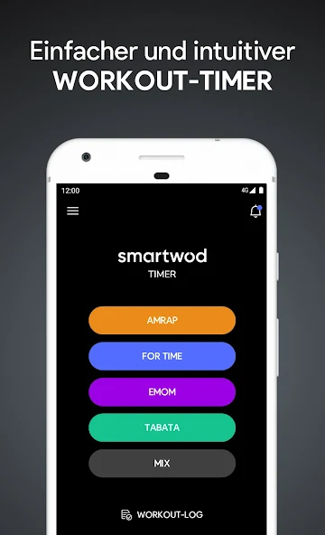
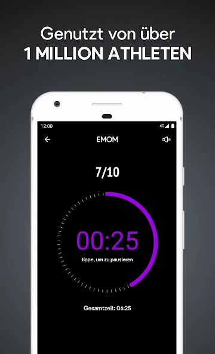
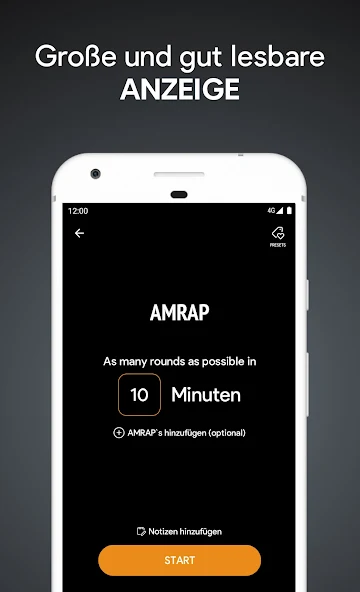
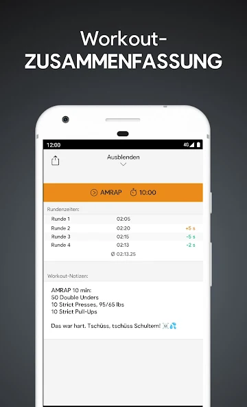
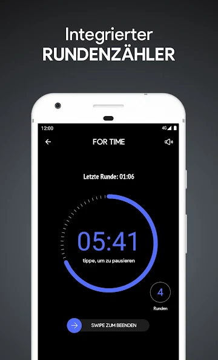
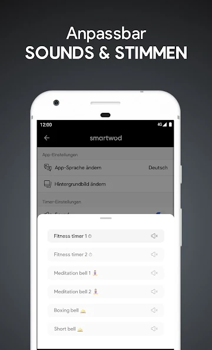
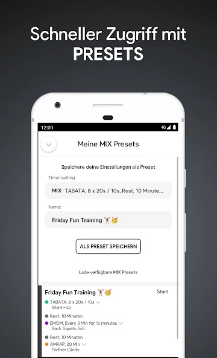
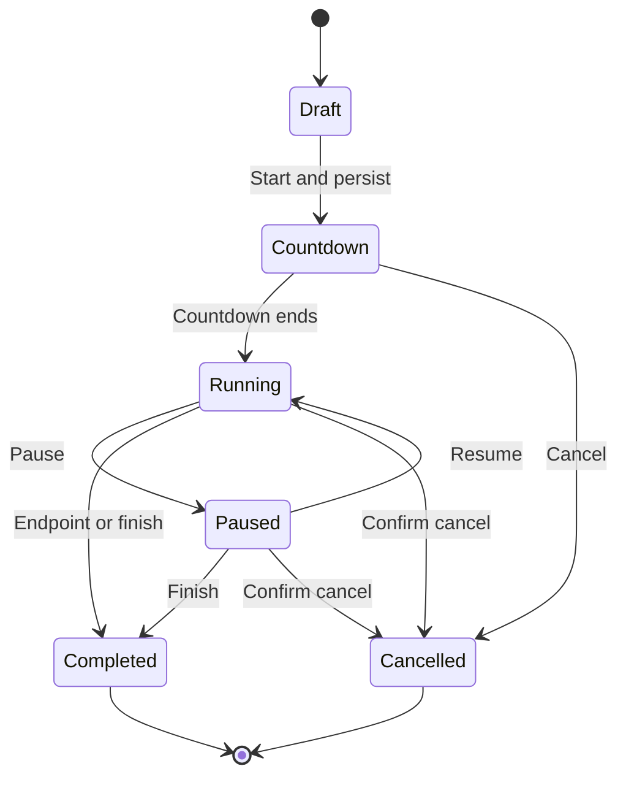

# Workout Timer product specification

## 1. Purpose

Build a fast, offline-first workout timer for functional fitness and interval training. The product should match the useful behavior and information hierarchy demonstrated by SmartWOD Timer while using this starter's architecture, design system, accessibility standards, and local-first data ownership model.

This is a functional reference, not a pixel-for-pixel or branded copy. The production app must use an original name, icon, copy, sounds, illustrations, and visual treatment. The downloaded screenshots in `references/images/` are internal implementation references only.

Reference source: [SmartWOD Timer on Google Play](https://play.google.com/store/apps/details?id=net.smartwod.timer&hl=de), inspected on 2026-08-08. The listing described AMRAP, For Time, EMOM, Tabata, a round counter, workout log, presets, sounds, and background continuation.

## 2. Reference gallery

| Mode selection | EMOM in progress |
| --- | --- |
|  |  |

| AMRAP setup | Workout summary |
| --- | --- |
|  |  |

| For Time and rounds | Sound settings |
| --- | --- |
|  |  |

| Presets | Completion |
| --- | --- |
|  |  |

See [references/README.md](./references/README.md) for the source, observations, and usage restrictions for every image.

## 3. Product principles

1. **Start quickly.** A returning athlete can begin a familiar timer in three deliberate taps or fewer.
2. **Readable at distance.** The current phase, remaining or elapsed time, and round are legible from several metres away.
3. **Time is authoritative.** Timer state is derived from timestamps, not from a decrementing interval that drifts when the app is backgrounded.
4. **Local-first.** Timers, presets, history, and notes work fully offline and remain on the device unless the user exports them.
5. **Calm under load.** Controls are large, mistakes are recoverable, and the running screen does not demand fine motor accuracy.
6. **Original identity.** Mode colors may aid recognition, but branding, layout details, icons, sounds, and copy must be ours.

## 4. Target users and jobs

- A solo athlete needs to configure and start a common workout without calculating intervals manually.
- A coach needs a large display that remains understandable across a room.
- A returning user needs presets and recent sessions so repeated workouts require little setup.
- A user mid-workout needs to pause, add a round, or finish without losing the session.
- A privacy-conscious user needs all core behavior offline, with export and import under their control.

## 5. Scope

### 5.1 MVP

- AMRAP timer.
- For Time stopwatch with optional target rounds and manual round capture.
- EMOM timer with configurable interval length and total rounds.
- Tabata timer with configurable work, rest, and round counts.
- Configurable three-second start countdown.
- Pause, resume, finish, cancel, and sound toggle during a session.
- Large running display with phase and round progress.
- Session completion screen with result and optional notes.
- Local workout history and session detail.
- Save, edit, duplicate, use, and delete single-mode presets.
- Sound, haptic, theme, language, start-countdown, and keep-awake settings.
- English and German UI.
- Local backup export/import covering presets, sessions, and relevant settings.
- Installable PWA that works without a network after first load.

### 5.2 Follow-up scope

- Mix timer that chains multiple timer segments.
- Sharing a generated summary image or text.
- Chromecast or another second-screen experience.
- Additional voice packs and custom sound imports.
- Advanced workout analytics and personal records.

### 5.3 Explicit non-goals

- SmartWOD name, logo, icon, copy, sound files, screenshots, or trade dress in the shipped product.
- Accounts, cloud sync, social feed, ads, subscriptions, or analytics in the MVP.
- Native-only guarantees such as exact background alarms while the browser or operating system has suspended the PWA.
- Exercise programming or workout generation.

## 6. Information architecture

Use the starter's config-driven `AppShell` and bottom navigation.

| Destination | Route | Shell behavior | Purpose |
| --- | --- | --- | --- |
| Timer | `/` | Bottom navigation visible | Choose a mode, quick-start a preset, or resume an active session |
| History | `/history` | Bottom navigation visible | Browse completed and cancelled sessions |
| Settings | `/settings` | Bottom navigation visible | Sound, haptics, appearance, language, data, and PWA preferences |
| Mode setup | `/timer/:mode` | Bottom navigation visible | Configure one timer and optionally save it as a preset |
| Presets | `/presets` | Bottom navigation visible | Manage saved configurations |
| Running session | `/session/:id` | `meta.hideNav: true` | Immersive timer and high-priority controls |
| Result | `/session/:id/result` | `meta.hideNav: true` | Record the outcome and notes before returning to the shell |
| Session detail | `/history/:id` | Bottom navigation visible | Read a persisted result and round splits |

The example Notes feature and center quick-add action are starter scaffolding and should be removed. The first product version should use three plain tabs with no center FAB. Presets are reachable from the Timer screen and do not need a fourth permanent tab.

## 7. Core flows

### 7.1 Start a timer

1. User opens Timer.
2. If a session is running or paused, a prominent Resume card appears before all other content.
3. User chooses AMRAP, For Time, EMOM, or Tabata, or selects a recent preset.
4. Setup opens with sensible defaults and inline validation.
5. User selects Start.
6. The app creates and persists the session before the countdown begins.
7. A visual and audible `3, 2, 1, Go` countdown plays when enabled.
8. The running route replaces the shell navigation.

### 7.2 Complete a timer

1. The configured endpoint is reached, or the user deliberately finishes early.
2. The app records the finish timestamp and reason before showing celebration UI.
3. Result displays mode, duration, rounds, splits, and configuration snapshot.
4. User may add notes and adjust the final round count.
5. Saving returns to History detail; Done without notes still preserves the session.

### 7.3 Recover an interrupted session

1. App startup queries for the newest session whose status is `countdown`, `running`, or `paused`.
2. The Timer home displays Resume and End actions.
3. Resuming reconstructs the view from persisted transition timestamps.
4. If the expected endpoint passed while the app was closed, the app completes the session at that endpoint rather than extending it to the reopen time.

### 7.4 Use a preset

1. User chooses a preset from Timer or Presets.
2. Setup is prefilled from the preset but remains editable.
3. Starting creates a configuration snapshot on the session; later preset edits never rewrite history.
4. Duplicate creates a new preset with `Copy` or the localized equivalent appended to its name.

## 8. Timer modes

| Mode | Required configuration | Clock behavior | Primary result |
| --- | --- | --- | --- |
| AMRAP | Duration | Counts down to zero | Rounds plus optional reps |
| For Time | Optional time cap; optional target rounds | Counts up from zero, stopping manually or at cap | Completion time and round splits |
| EMOM | Interval duration; round count | Counts down within each interval and advances rounds | Completed intervals and total time |
| Tabata | Work duration; rest duration; round count | Alternates work/rest; no final rest | Completed rounds and total time |

### 8.1 Defaults and limits

| Setting | Default | Allowed range |
| --- | --- | --- |
| AMRAP duration | 10 minutes | 1 second to 24 hours |
| For Time cap | None | None, or 1 second to 24 hours |
| For Time target rounds | None | None, or 1 to 999 |
| EMOM interval | 1 minute | 5 seconds to 60 minutes |
| EMOM rounds | 10 | 1 to 999 |
| Tabata work | 20 seconds | 1 second to 60 minutes |
| Tabata rest | 10 seconds | 0 seconds to 60 minutes |
| Tabata rounds | 8 | 1 to 999 |
| Start countdown | 3 seconds | Off, 3, 5, or 10 seconds |

All values are stored as integer milliseconds or integer counts. Setup fields may present hours, minutes, and seconds but must never persist formatted time strings as the source of truth.

## 9. Session state and timing model



The timer engine is domain logic, not component state.

- Persist transition timestamps: `startedAt`, `pauseStartedAt`, `accumulatedPausedMs`, `finishedAt`, and the current phase index.
- Derive elapsed time as `now - startedAt - accumulatedPausedMs - activePauseDuration`.
- Derive remaining time from the configured endpoint minus elapsed time.
- Use Effect's `Clock` in domain programs so boundary behavior is deterministic under `TestClock`.
- Repaint with `requestAnimationFrame` while visible. A lower-frequency fallback may update document title or accessibility text, but no interval tick is authoritative.
- Persist only transitions, rounds, and edits. Do not write to IndexedDB every second.
- Clamp displayed values at valid bounds. A countdown never renders a negative number.
- Trigger phase sounds by comparing the previous derived state with the current derived state. On resume after a long suspension, do not replay every missed beep.

Only one active session may exist. Starting while another session is active requires the user to resume or end the existing session.

## 10. Screen requirements

### 10.1 Timer home

- Page title and compact settings affordance.
- Resume card when an active session exists.
- Four large mode buttons with icon, name, and one-line explanation.
- Mode identity is reinforced by a semantic accent: AMRAP amber, For Time indigo, EMOM violet, Tabata teal.
- Recent presets section, limited to the last four used, followed by View all presets.
- Empty state explains that presets are optional and timers can start without them.

### 10.2 Mode setup

- Uses `PageLayout` and `PageHeader`.
- Mode name and concise explanation at the top.
- Large, direct time/count controls with numeric keyboard support.
- Optional workout description or notes.
- Save as preset is secondary to Start.
- Sticky footer contains the mode-colored Start button.
- Invalid fields show an inline message and `aria-describedby`; Start remains disabled until the configuration is valid.

### 10.3 Running session

- Full-screen, dark immersive surface independent of the app theme for reliable distance contrast.
- Top row: back/cancel, mode name, sound toggle.
- Centre: phase label, round progress, and the largest possible timer that does not clip at 320 CSS pixels wide.
- Progress ring is supplemental; the numeric time remains primary.
- Bottom controls: pause/resume and the mode-specific action.
- AMRAP and For Time provide Add round with at least a 56 by 56 CSS-pixel target.
- Finishing or cancelling requires a deliberate hold, swipe, or confirmation sheet. A single accidental tap must not destroy the run.
- Keep-awake uses the Screen Wake Lock API when available and enabled. Losing the lock is not treated as session failure.

### 10.4 Result

- Completion treatment may use restrained motion and haptics but must respect reduced motion.
- Shows mode, elapsed duration, rounds, and splits.
- Notes are editable before saving.
- Primary action saves and opens session detail.
- Secondary action returns home; the session is already persisted and cannot be lost by navigating away.

### 10.5 History and detail

- History is grouped by local calendar day and sorted newest first.
- Each row shows mode, result, completion state, and start time.
- Filters: All, AMRAP, For Time, EMOM, Tabata.
- Detail shows the immutable configuration snapshot, timing result, round splits, and notes.
- Delete requires confirmation and is available from detail, not as an easy-to-hit row action.

### 10.6 Presets

- Presets are sorted by last used, then updated date.
- Each card exposes Start, Edit, and an overflow menu for Duplicate and Delete.
- Expanding a card reveals the complete configuration without starting it. This avoids the interaction ambiguity called out in a review on the reference listing.
- A preset name is required and limited to 80 Unicode characters.

### 10.7 Settings

- Sound on/off and sound pack preview.
- Haptic cues on/off when vibration is supported.
- Spoken countdown on/off as a separate preference from tones.
- Start countdown duration.
- Keep screen awake on/off.
- Theme and language reuse the existing starter composables.
- Export, import, and delete all data reuse the starter's local-first data patterns.
- Unsupported capabilities are explained or omitted; never render a control that silently does nothing.

## 11. Sound, haptics, and background behavior

- Ship only original or appropriately licensed audio files and precache them for offline use.
- Unlock audio after the user's Start gesture before the countdown begins.
- Provide distinct cues for countdown, phase change, final seconds, round capture, pause, and completion.
- Never rely on sound alone. Every cue has a visual state change; haptics are optional reinforcement.
- Respect silent user preferences inside the app.
- When hidden or suspended, elapsed time remains correct because it is timestamp-derived. Browser and operating-system limits mean background audio is best effort; the UI must describe this honestly in Settings.
- On `visibilitychange`, immediately recompute state and emit at most the current relevant cue.

## 12. Data model

The exact Effect Schema syntax belongs in implementation, but the persisted domain requires these concepts.

### 12.1 `TimerPreset`

- `id: string`
- `name: string`
- `mode: 'amrap' | 'forTime' | 'emom' | 'tabata'`
- `config: TimerConfig`
- `workoutNotes?: string`
- `createdAt: number`
- `updatedAt: number`
- `lastUsedAt?: number`

### 12.2 `WorkoutSession`

- `id: string`
- `presetId?: string`
- `mode`
- `configSnapshot`
- `status: 'countdown' | 'running' | 'paused' | 'completed' | 'cancelled'`
- `startedAt`
- `countdownEndsAt?: number`
- `pauseStartedAt?: number`
- `accumulatedPausedMs`
- `finishedAt?: number`
- `finishReason?: 'endpoint' | 'manual' | 'timeCap' | 'cancelled'`
- `rounds: ReadonlyArray<{ capturedAtElapsedMs: number; reps?: number }>`
- `notes?: string`
- `createdAt`
- `updatedAt`

### 12.3 `TimerSettings`

- Sound enabled and selected pack.
- Spoken countdown enabled.
- Haptics enabled.
- Start countdown duration.
- Keep-awake preference.

Theme and locale may continue using their existing starter persistence seams, but backup export must include all user-owned workout data and product-specific settings.

### 12.4 Storage rules

- Effect Schema is the source of truth for current and historical row shapes.
- Every read passes through a converter that normalizes older versions.
- Add repositories under `src/db/repositories/` and expose only through `src/db/index.ts`.
- Add `PRESETS_KEY`, `SESSIONS_KEY`, and `SETTINGS_KEY` invalidation keys for atom reactivity.
- Backups carry an app-specific identifier and explicit version. Import validates unknown JSON before any write.
- This is an unshipped starter, so implementation may replace the Notes schema and choose a product database name before release. If any build with real user data has already shipped, add a forward migration instead of renaming or deleting the database.

## 13. Repository architecture

Follow the repository's enforced boundaries rather than introducing a second state or component system.

```text
src/features/timer/
  atoms.ts                 active-session read state
  domain.ts                pure timer math, validation, transitions
  engine.ts                Clock-driven orchestration and effects
  types.ts                 discriminated mode/config types
  components/              mode cards, setup controls, running display

src/features/history/
  atoms.ts
  domain.ts
  components/

src/features/presets/
  atoms.ts
  domain.ts
  components/

src/db/
  converters.ts            Effect Schemas and legacy normalization
  schema.ts                Dexie tables and migrations
  backup.ts                complete versioned export/import
  repositories/
    sessions.ts
    presets.ts
    timerSettings.ts

src/views/
  TimerHomeView.vue
  TimerSetupView.vue
  TimerRunView.vue
  TimerResultView.vue
  HistoryView.vue
  SessionDetailView.vue
  PresetsView.vue
  SettingsView.vue
```

Implementation rules:

- Use `@effect/atom-vue`; do not add Pinia.
- Read atoms subscribe to repositories and invalidate through `dbMutation` keys.
- Components compose tagged failures into visible page states or actionable toasts before running mutations.
- Features never import other features. Move shared timer presentation pieces to `src/components/` only after two consumers exist.
- UI primitives come from `@/components/ui/*`; feature code does not import Reka UI directly.
- User-facing strings exist in both `src/i18n/messages/en.ts` and `de.ts`.
- Running-session routes use `meta.hideNav` rather than creating a separate shell.

## 14. Visual system

- Retain the starter's semantic Tailwind v4 tokens and `cn()`-based primitives.
- Add semantic mode tokens instead of scattering hex values: `--color-mode-amrap`, `--color-mode-for-time`, `--color-mode-emom`, and `--color-mode-tabata`, each with a tested foreground color.
- The running screen uses near-black background, high-contrast white text, and one mode accent. It should feel focused, not branded like the reference app.
- Minimum touch target is the starter's `min-h-touch-target`; high-priority running controls use 56 CSS pixels or more.
- Support 320-pixel phone width, modern phone widths, tablet portrait, and landscape. Landscape may arrange timer and controls side by side.
- Use tabular numerals for all clocks so digits do not shift horizontally.
- Do not import the reference icon, device frames, gradients, typography, or celebration artwork into production assets.

## 15. Accessibility

- Meet WCAG 2.2 AA for contrast, focus visibility, labels, target size, and keyboard operation.
- Timer values are text, not canvas-only output.
- Announce phase changes, pause/resume, captured rounds, and completion through a polite live region. Do not announce every second.
- Icon-only actions include localized accessible names that describe the action and current state.
- Color never carries mode or phase meaning by itself.
- Reduced-motion users receive a static completion state and non-animated progress changes.
- Sound previews have visible play/stop state.
- Confirmation sheets trap focus and remain usable with a software keyboard, reusing the starter's `DialogContent` behavior.

## 16. Failure and edge behavior

- A storage failure blocks Start before a false-running session can appear and provides a retry action.
- A round capture is optimistic only after its mutation is accepted; repeated taps within 250 ms are coalesced.
- System-clock changes are detected by comparing epoch and monotonic deltas. If drift exceeds five seconds, recompute safely and log the boundary; never produce negative elapsed time.
- Import while a session is active is blocked with an explanation.
- Delete all data is blocked while a session is active.
- Leaving the running route does not pause the timer. Only Pause changes timing state.
- Browser back from a running timer opens the exit confirmation instead of silently cancelling.
- An unavailable Wake Lock, Vibration, or audio capability degrades without preventing the timer from running.

## 17. Testing strategy

Use the starter's existing tiers.

| Tier | Required coverage |
| --- | --- |
| Unit | Mode validation; state transitions; AMRAP, For Time, EMOM, and Tabata boundary math; pause accumulation; clock change handling; session summaries; preset sorting; converters |
| Default browser | Configure and start every mode; pause/resume; capture a round; complete and save notes; resume after remount; preset create/edit/duplicate/delete |
| Database | Repository CRUD; one-active-session invariant; historical row conversion; backup round-trip; invalid import rejection |
| Accessibility | Timer home, every setup variant, running screen, result, history, settings, and confirmation sheet |
| Visual | Timer home in light/dark; one setup screen; running screen for each phase family; result; 320-pixel width; tablet portrait |
| Architecture | Generic boundary tests should pass without exceptions; add coverage only for a genuinely new rule |
| E2E | Start AMRAP, reload during the run, verify authoritative remaining time, complete, and verify persisted history; install/offline smoke |
| Mutation | Timer math, validation, transitions, and backup logic must meet the repository threshold |

Timer tests use Effect `TestClock` or explicit clock inputs. They must not sleep in real time.

## 18. MVP acceptance criteria

The MVP is complete when all of the following are true:

- A user can configure and start each of the four timer modes while offline.
- After backgrounding or reloading for at least 30 seconds, displayed time is within one second of timestamp-derived expected time.
- Pause time never contributes to workout elapsed time.
- EMOM and Tabata cross every phase boundary exactly once in deterministic tests.
- Round capture survives reload and appears in the completed session summary.
- An active session is resumable after a full page reload without user data loss.
- A completed session appears in History with the immutable configuration snapshot used at start.
- Preset edits do not alter past sessions.
- Export followed by delete/import restores presets and session history.
- All core flows work with sound disabled and without Wake Lock or Vibration support.
- English and German catalogs are complete and type-check.
- Axe reports no serious or critical violations on the required screens.
- The 320-pixel running view shows the entire primary time and controls without horizontal scrolling.
- `pnpm check`, `pnpm test`, `pnpm test:a11y`, `pnpm test:visual`, `pnpm test:e2e`, `pnpm build`, and `pnpm size-limit` pass.
- A manual installed-PWA walkthrough verifies start, background/resume, completion, reload, history, export, and offline launch on a phone-sized viewport.

## 19. Delivery slices

1. **Foundation:** remove Notes scaffolding, establish product routes/i18n, add timer mode types, validation, schemas, migrations, repositories, and backup shape.
2. **Timer engine:** implement timestamp-derived transitions and exhaustive unit tests for all modes.
3. **Start flow:** build Timer home and mode setup with original mode visuals.
4. **Running flow:** immersive route, controls, progress, wake lock, sounds, haptics, and recovery.
5. **Results and history:** completion, notes, summaries, history, detail, deletion.
6. **Presets:** create, edit, duplicate, quick start, and recent ordering.
7. **Hardening:** accessibility, visual states, offline E2E, backup migration tests, mutation tests, and real-device PWA walkthrough.

Mix timers, sharing, casting, and additional voice packs begin only after the MVP acceptance criteria are satisfied.
